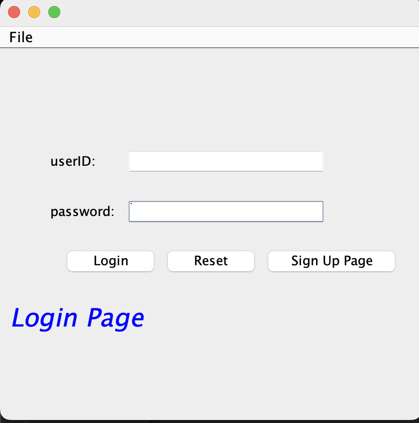
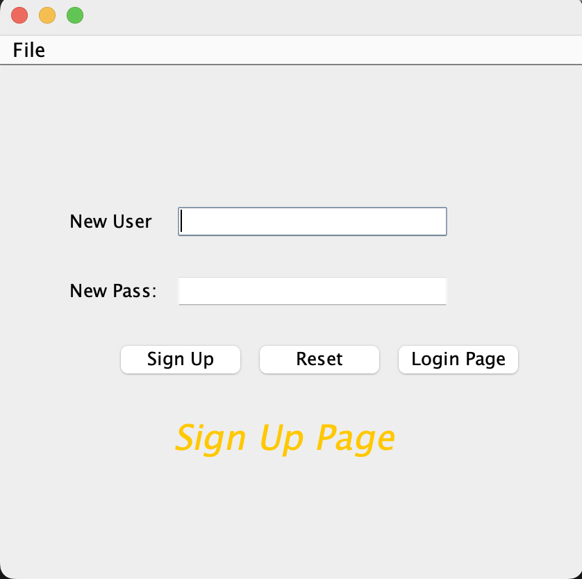
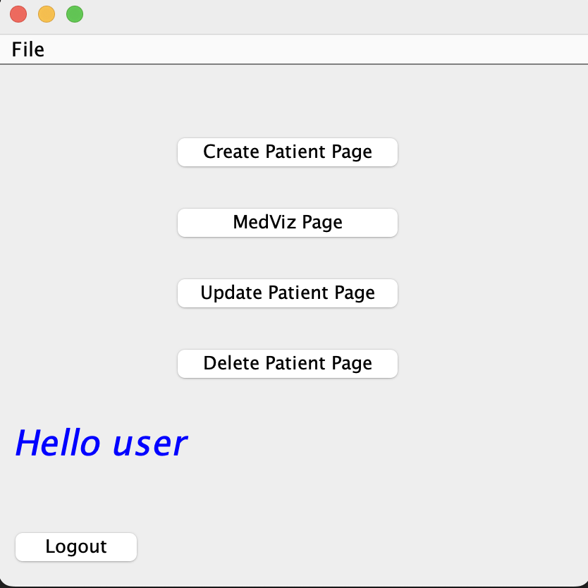
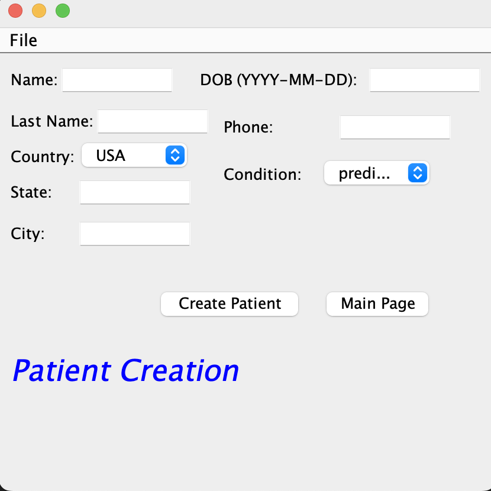
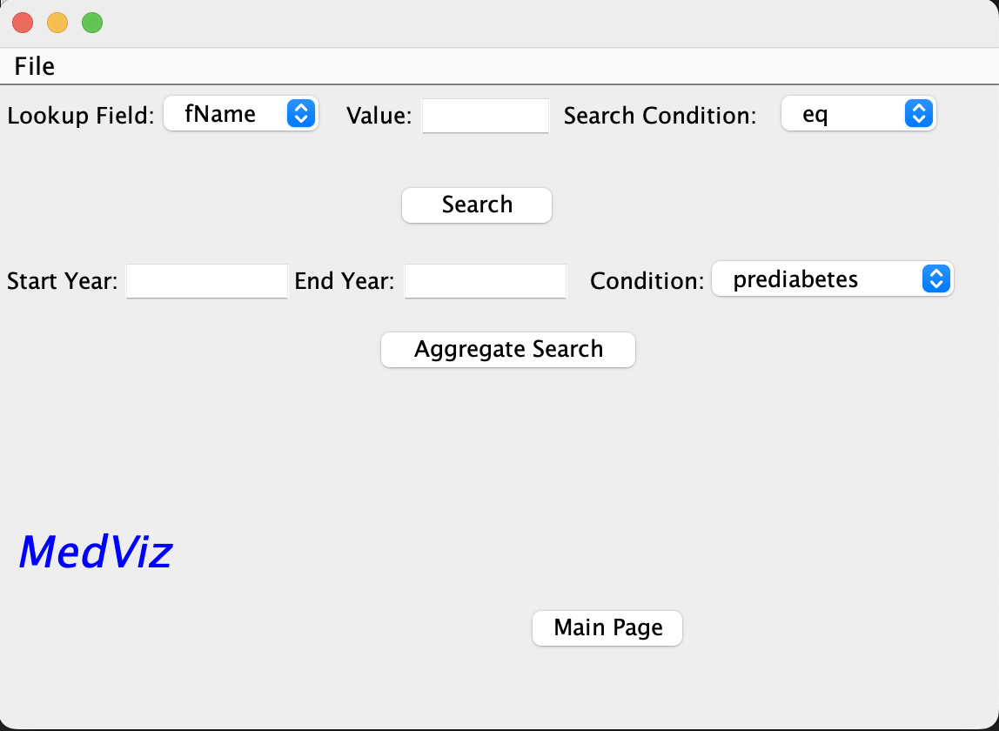
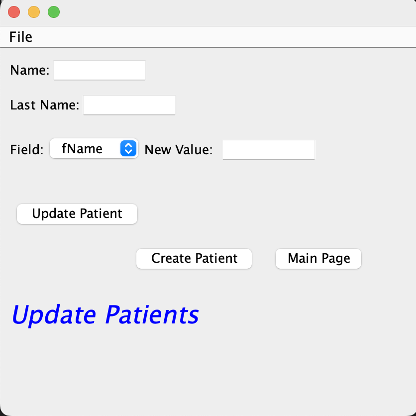
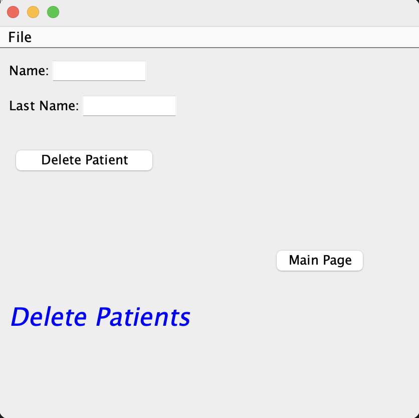

<!-- Back to top Link -->

<!-- PROJECT LOGO -->
 

  

<h3 align="center">MedViz</h3>

  

    A data visualization application focused on empowering users to derive meaningful insights from medical data
  

<!-- TABLE OF CONTENTS -->

  
Table of Contents

  <ol>
    <li>
      <a href="#about-the-project">About The Project</a>
      <ul>
        <li><a href="#project-proposal">Project Proposal</a></li>
        <li><a href="#systems-analysis">Systems Analysis</a></li>
        <li><a href="#data-sources">Data Sources</a></li>
      </ul>
    </li>
    <li>
      <a href="#concepts-covered">Concepts Covered</a>
      <ul>
        <li><a href="#GUI">Graphical User Interface</a></li>
        <li><a href="#networking">Networking</a></li>
        <li><a href="#concurrency">Concurrency</a></li>
        <li><a href="#database-support">Databases</a></li>
      </ul>
    </li>
    <li><a href="#feature-list">Feature List</a>
        <ul>
            <li><a href="#login">Login</a></li>
            <li><a href="#sign-up">Sign-Up</a></li>
            <li><a href="#patient-creation">Patient Creation</a></li>
            <li><a href="#value-lookup-search">Value Lookup Search</a></li>
            <li><a href="#patient-update">Patient Update</a></li>
            <li><a href="#patient-deletion">Patient Deletion</a></li>
            <li><a href="#aggregate-value-search">Aggregate Value Search</a></li>
        </ul>
    </li>
    <li><a href="#feature-list">Project Setup</a></li>
  </ol>

<!-- ABOUT THE PROJECT -->
## About The Project

### Project Proposal
The Medical Visualizer, or MedViz for short, is a data visualization application focused on empowering users to derive meaningful insights from medical data including but not limited to patient records, and administrative payroll information.

### Systems Analysis
MedViz extends the foundational, three-tiered data system by re-implementing it from the ground up with increased polish and refinement. The system will have a user interface layer in which users interact with a simple to understand GUI to read data and visualize the results. Users will be able to create logins with special priviledges for admin accounts with passwords being stored with proper password hashing and salting. Queries are processed and converted into accurate and performant logic in the second client tier of the system. Additionally, The server tier is connected to a NoSQL database and can handle multiple client requests, ultimatley serving results to clients using Restful APIs. The system will be concurrency safe to support multiple simultaneous client connections and can even run certain query types in parallel to maximize server load efficiency.

### Data Sources
Data is drawn from Synthea. A project released by best-in-class Not-for-profit MITRE containing synthetic patient and population health data from the state of Massachusetts. Data will be loaded into and queried from a GCP Firestore NOSQL database hosted on a Firebase instance.
- [Synthea](https://synthea.mitre.org/)

(<a href="#readme-top">back to top</a>)

<!-- Concepts Covered -->
## Concepts Covered

### GUI
The project's graphical user interface, or GUI was built primarily with Java's Swing library. It uses a single frame which is repainted as necessary.
The different frame paints include:
  
  

  1. Login Page:
  The page where the user logs in. Only verified users are a logged in and Admin accounts are given special priveledge. Additionally, the user is given a message that details whether entered information is missing, a username does not exist, or a password is incorrect. Navigation to the sign up page and a credential reset button is available.
  
  
  

  2. Sign-Up Page:
  The page where a use can sign up. Checks are run on whether credentials are left empty and if a username is taken. The user is correspondingly notified. Once a user is signed up they can navigate to the login page and login using their credentials.
  
  
  

  3. Main Page:
  The main page functions as a way to naviage to the different parts of MedViz including the create, update, and delete patient information pages and the MedViz vizualization page. All of those pages contain a link to navigate back to the main page. Users can also logout from the main page which closes the client application.

  
  

  4. Create Patient Page:
  The create patient page allows users to enter patient information in order to create a new patient record in the database. Input validation is conducted at the client level. Additionally, if users try to create a patient that already exists, they are notified of this error.

  
  

  5. MedViz Page:
  The MedViz Page allows for two different types of data visualization. The first is a visuzalization based on looking up a particular value with choices for the types of conditions applied to that value, including equals to, less than, less than or equals to, greater than, greater than or equals to, and not equals to. The second visualization allows users to search up frequency of a given condition, selected from a drop down menu, betweeen a range of years. This is the marquee feature of MedViz.

  
  

  6. Update Patient Page:
  The Update patient page allow users to update any value within a patient record. Standard input validation and patient existence checking is applied.

  
  

  7. Delete Patient Page:
  Admin privledged users can delete patient records from the database.

### Networking
Networking is implemented using the traditional client-server architecture. A MedViz client runs as a standalone program which connects over a netowork to a MedViz server. This enables multiple clients to connect to the same server. Servers handle clients by receiving the connection in a dedicated thread. This allows for the server to communicate with clients individually and isolate information exchange. 

### Concurrency
Concurrency in MedViz is implemented at two levels. The first is at the database source. Firestore has been configured such that no records can be read or written to at the same time making it threadsafe. On the second level, locks have been used within the server program so that no two clients trigger race conditions when communicating with the database through the server.

### Database Support
MedViz uses Google's Firestore service. Google Firestore is a cloud-based NoSQL document database that enables MedViz to store, sync, and query data from within the Java application. It was chosen due to ease of configuration scalability, allowing us to load the database with several thousand patient records, leading to a meaningful prototype. Firestore empowes MedViz's user authentication system, patient record interaction, and general data storage.

(<a href="#readme-top">back to top</a>)

<!-- Feature List -->
## Feature List

### Login
- User login and authentication
- Responsive user messaging

### Sign Up
- Account creation
- Account creation validation
- Responsive user messaging

### Patient Creation
- New patient record creation
- Input validation

### Value Lookup Search
- Field value look up
- 7 different look up conditions supported
- result visualization

### Patient Update
- Patient record updating
- Input Validation
- Responsive messaging

### Patient Deletion
- Patient Deletion
- Seperation between admin and average user priveledges

### Aggregate Value Search
- Search for condition data bounded by year
- input validation
- Data visualization

(<a href="#readme-top">back to top</a>)

## Project Setup
MedViz can be set up on your system by....

(<a href="#readme-top">back to top</a>)

<!-- MARKDOWN LINKS & IMAGES -->
[product-screenshot]: images/loginTemp.png
[login]: images/login.png
[signup]: images/signUp.png
[create]: images/patientCreation.png
[delete]: images/deletePatient.png
[update]: images/updatePatient.png
[search]: images/medViz.png
[main]: images/main.png